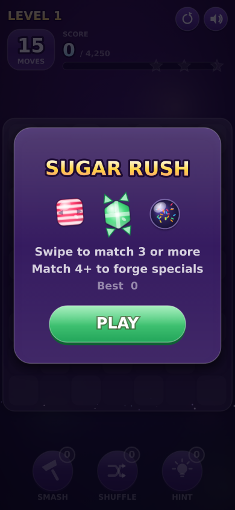
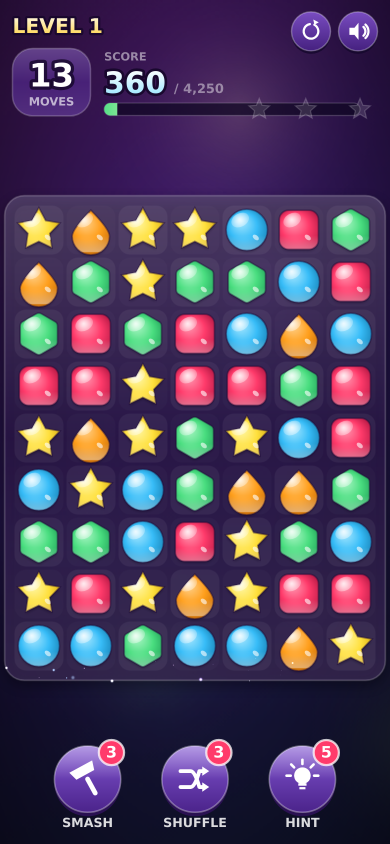
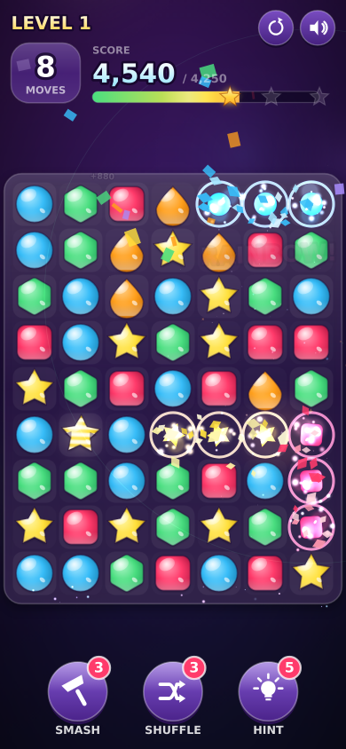
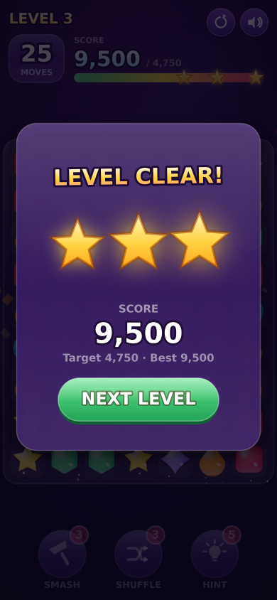

# 🍬 Sugar Rush

A mobile-first, Candy-Crush-style match-3 game built on a bare HTML5 canvas — with a
particle system built for juice.

No game engine, no sprite sheets, no audio files. Every candy is drawn procedurally,
every sound is synthesised with the Web Audio API, and the whole thing ships in
**~23 KB gzipped**.

| Menu | Cascade | Colour bomb | Level clear |
|---|---|---|---|
|  |  |  |  |

---

## Run it

```bash
npm install
npm run dev          # → http://localhost:5173
```

It's built for a phone. On desktop, open devtools and switch to a mobile viewport
(the game works with a mouse too — drag a candy, or tap one then tap its neighbour).

| Script | What it does |
|---|---|
| `npm run dev` | Vite dev server |
| `npm run build` | Typecheck + production bundle |
| `npm test` | Headless rules soak test (1500 simulated moves) |
| `npm run test:calibrate` | Difficulty simulation across levels |
| `npm run shots` | Drives the real game in headless Chromium and screenshots it |

---

## How it plays

Swipe to swap two adjacent candies. Line up three or more and they pop, the ones
above fall in, and any new matches cascade — each step in a chain scores more and
pitches the sound effect a note higher.

**Specials** are forged from bigger matches and are where the fireworks live:

| Match | Candy | Effect |
|---|---|---|
| 4 in a row | **Striped** | Clears the whole row or column |
| L / T shape | **Wrapped** | 3×3 detonation |
| 5 in a row | **Colour bomb** | Vaporises every candy of one colour |

Swapping two specials together combines them — striped + striped clears a full
cross, wrapped + wrapped is a 5×5 blast, and a colour bomb swapped onto a striped
candy turns every candy of that colour striped and sets them all off at once.

Three **boosters** per level: smash a single candy, reshuffle the board, or light up
a hint. If the board ever runs out of legal moves it reshuffles itself automatically.

---

## Where the juice comes from

"Juicy" isn't one effect, it's a pile of small ones firing together. Every candy
that pops triggers:

- **Shards** that tumble under gravity in the candy's own colours
- **Additive sparks** for the bloom, on a separate render pass so the glow stacks
- **A shockwave ring** that expands and thins out
- **Sugar dust** drifting upward
- **Squash-and-stretch** — candies inflate before they implode, and land with a bounce
- **Screen shake** using a trauma model (shake² so small hits stay subtle and big
  ones really kick), plus **hit-stop** that freezes time for ~50 ms on a detonation
- **A screen flash**, colour-matched to whatever just exploded
- **Floating score text** that pops in with an elastic overshoot
- **Haptics** via `navigator.vibrate`, with a pattern per event type
- **A rising musical note** per cascade step, climbing a pentatonic ladder

```
src/fx/
  particles.ts   pooled, zero-allocation particle system (2600 slots)
  emitters.ts    named presets — candyPop, explosion, bombBurst, stripeBeam…
  floaters.ts    score / combo popups
  shake.ts       trauma-based shake, hit-stop and screen flash
```

### Making it fast enough for a phone

The naïve version of this ran at ~15 fps under a software rasteriser. Two changes
did most of the work:

1. **Bake every gradient once.** `createRadialGradient` per particle per frame is
   the single most expensive thing you can do in Canvas 2D. Particle glows, comet
   streaks, background bokeh and the vignette are all pre-rendered into small
   offscreen canvases and blitted instead.
2. **Bake the static layers.** The board frame, its `shadowBlur`, and all 63 cell
   tiles never change, so they're rendered once per resize into one canvas and
   drawn with a single `drawImage`.

Measured in the same headless software-rendered environment, that took the frame
time from **65 ms → ~48 ms** (the harness reports it on every run). On a real
device with GPU compositing there's a lot more headroom — and the particle system
still scales its own emission counts down automatically if frames start slipping.

---

## Architecture

```
src/
  main.ts                 boot
  core/
    game.ts               the shell: layout, HUD, input routing, game states
    game-config.ts        level curve + board size  (deliberately DOM-free)
    board.ts              the rule engine          (deliberately DOM-free)
    input.ts              pointer / touch / mouse plumbing
    types.ts  rng.ts      shared vocabulary and easing
  render/
    sprites.ts            procedural candy art, cached per size
    background.ts         animated backdrop
  fx/                     particles, emitters, floaters, screen shake
  ui/
    hud.ts  icons.ts      canvas widgets and vector glyphs
  audio/sfx.ts            Web Audio synthesis
```

`board.ts` and `game-config.ts` don't touch the DOM. That's the load-bearing
decision in the whole project: it means the rules and the balance can be tested
headlessly at thousands of moves per second, without a browser.

### Candies are drawn, not loaded

Six candy families (jelly square, drop, star, hexagon, sphere, rhombus) are drawn
as paths with a radial body gradient, a rim light, a gloss highlight and an
outline. Each `(colour, special)` combination is rendered once into an offscreen
canvas at the current cell size and blitted from then on — so per-frame cost is a
`drawImage`, and changing the board size just rebuilds the cache.

---

## Testing

### `npm test` — rules soak test

Runs the real `Board` class headlessly at a fixed timestep for 1500 moves and
asserts the invariants that matter after *every single move*:

- the grid never has a hole once settled
- no un-cleared match is ever left behind
- visual positions always converge to logical positions (no desynced tiles)
- a legal move always exists when control returns to the player
- the resolver always terminates

Plus targeted fixtures for each rule — 4-in-a-row forges a striped candy, 5 forges
a colour bomb, an L-shape forges a wrapped candy, a striped candy chain-clears its
row, a colour bomb clears every candy of its colour, and a provably dead board
auto-shuffles into a playable one.

```
✓ initial deal (7x9) is match-free and playable
✓ 4-in-a-row forges a striped candy
✓ 5-in-a-row forges a colour bomb
✓ L-shaped match forges a wrapped candy
✓ striped candy chain-clears its entire row
✓ colour bomb cleared all 10 candies of one colour
✓ dead board auto-shuffles into a playable one
✅ all invariants held
```

### `npm run test:calibrate` — difficulty simulation

A greedy bot (always takes the move that clears the most) plays 400 boards per
level and reports the score distribution against the level's target.

This caught a real balance bug. Score per move is essentially *flat* — around
365 points with six colours — but the original targets grew linearly, so by
level 5 the levels were mathematically unwinnable:

```
 lvl   target   median   clear-rate
   4    9,979    8,000       23%     ← impossible for most players
   8   16,694    8,090        1%
```

Targets are now priced as a fraction of what a good player is *expected* to
score, easing from 45% up to an asymptote — which produces a curve that actually
ramps:

```
 lvl  col  moves    target   median      p25      p75  clear  3-star
   1    5     15     4,250    9,400    6,940   12,865    97%     74%
   3    6     25     5,000    9,180    7,575   10,695   100%     63%
   6    6     25     6,000    9,090    7,690   10,920    97%     37%
  10    6     24     6,750    8,725    7,305   10,505    84%     18%
  20    6     22     7,500    8,130    6,635    9,820    59%      7%
```

The constants that shape this all live in `src/core/game-config.ts`, and the
simulator imports the same file the game ships — so the numbers can't drift apart.

### `npm run shots` — visual smoke test

Drives the actual game in headless Chromium at an iPhone viewport: taps PLAY
through the game's own hit-testing, asks the board for legal moves and swipes
them, forces each special to detonate, and screenshots the result. It fails the
run on any console error, uncaught exception or failed request, checks the canvas
isn't blank, and reports frame timings.

Requires a browser: `npx playwright install chromium`. In a locked-down
environment, point `CHROME_BIN` (and `CHROME_LIBS`) at an existing build instead.

---

## Notes

- **Board shape is 7×9, not square.** A portrait phone is far taller than it is
  wide; a square grid either leaves a third of the screen empty or shrinks the
  candies. Tall-and-narrow fills the screen and makes each candy ~20% bigger,
  which matters a lot for thumbs.
- **Icons are vector paths, not emoji.** Emoji were the quick option, but they
  render as tofu boxes wherever there's no emoji font (including the test
  harness, which is how this got caught) and their metrics vary per platform.
- **Progress persists** in `localStorage`: current level, best score, mute state.
- Safe-area insets are respected, so the HUD and booster bar clear the notch and
  the home indicator.
